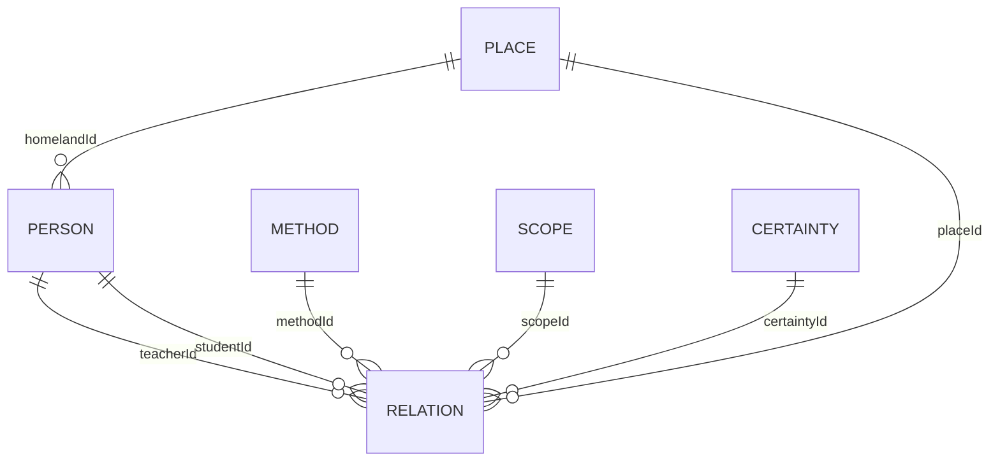

# Kıraat Ağı - Faz 1 Entity Modeli

## Kapsam

Bu belge Faz 1 için sade iş modelini tanımlar. Bu aşamada kaynak yönetimi,
onay akışı, import süreci, kişi birleştirme ve mükerrer kayıt yönetimi kapsam
dışındadır.

Model iki ana entity ve dört sözlük entity'sinden oluşur:

- `Person`
- `Relation`
- `Method`
- `Scope`
- `Certainty`
- `Place`

Audit kayıtları domain modelinden ayrı teknik tablolarla tutulur. Audit
entity'leri ve kayıt kuralları için
[audit-plan.md](../technical/audit-plan.md) belgesi esas alınır.

## Person

Kıraat ağındaki kişiyi temsil eder.

| Alan | Zorunlu | Açıklama |
|---|---:|---|
| `id` | Evet | Uygulamanın ürettiği ve ilişkilerde kullandığı dahili kişi ID'si |
| `extSourceId` | Evet | Çalışılan dış kaynaktaki integer kişi ID'si |
| `name` | Evet | Ağda ve listelerde gösterilecek kısa kişi adı |
| `nameDescription` | Hayır | Tam isim, künye, nisbe, lakap veya ayırt edici isim açıklaması |
| `birthYearHijri` | Hayır | Hicrî doğum yılı veya tarih ifadesi |
| `birthYearGregorian` | Hayır | Miladî doğum yılı veya tarih ifadesi |
| `deathYearHijri` | Hayır | Hicrî vefat yılı veya tarih ifadesi |
| `deathYearGregorian` | Hayır | Miladî vefat yılı veya tarih ifadesi |
| `homelandId` | Hayır | Memleket olarak seçilen `Place.id` |
| `detailNote` | Hayır | Kişi hakkında serbest ve ayrıntılı açıklama |
| `createdAt` | Sistem | Kaydın oluşturulma zamanı |
| `updatedAt` | Sistem | Kaydın son güncellenme zamanı |

### Person kuralları

- `id` uygulamanın dahili anahtarıdır; kullanıcı tarafından belirlenmez.
- `extSourceId` araştırmacıların çalıştığı dış kaynak numarasıdır.
- `extSourceId` veritabanında integer olarak tutulur.
- `extSourceId` zorunlu ve benzersizdir.
- `extSourceId`, ilişki foreign key'i olarak kullanılmaz. İlişkiler dahili
  `Person.id` üzerinden kurulur.
- `name` kısa gösterim adıdır. Örnek: `Âsım`.
- `nameDescription` ayrıntılı isim bilgisidir. Örnek:
  `Âsım b. Ebî'n-Necûd, Ebû Bekir, el-Kûfî`.
- Doğum ve vefat bilgileri bilinmiyorsa boş bırakılabilir.
- Tarih alanları `1000`, `1000-1001` veya `yaklaşık 1000` gibi ifadeleri kabul eder.
- Memleket, ilişki mekânlarıyla aynı `places` tablosundan seçilir ve kişi başına
  en fazla bir tane olabilir.

## Relation

İki kişi arasındaki kıraat öğrenim veya aktarım ilişkisini temsil eder.
İlişkinin yönü her zaman `Hoca -> Talebe` şeklindedir.

| Alan | Zorunlu | Açıklama |
|---|---:|---|
| `id` | Evet | İlişkinin dahili ID'si |
| `teacherId` | Evet | Hoca olan kişinin `Person.id` değeri |
| `studentId` | Evet | Talebe olan kişinin `Person.id` değeri |
| `scopeId` | Evet | İlişkinin kapsamı |
| `certaintyId` | Evet | İlişkinin kesinlik düzeyi |
| `methodId` | Evet | Kıraatin alınma veya aktarılma yöntemi |
| `placeId` | Hayır | İlişkinin gerçekleştiği mekân |
| `detailNote` | Hayır | İlişkiye özel serbest ve ayrıntılı açıklama |
| `createdAt` | Sistem | Kaydın oluşturulma zamanı |
| `updatedAt` | Sistem | Kaydın son güncellenme zamanı |

### Relation kuralları

- `teacherId` ve `studentId` aynı olamaz.
- Hoca ve talebe olarak seçilen kişiler sistemde kayıtlı olmalıdır.
- `scopeId`, `certaintyId` ve `methodId` zorunludur.
- Mekân bilinmiyorsa `placeId` boş bırakılır.
- Aynı hoca-talebe çifti farklı yöntem veya kapsamlarla birden fazla ilişkiye
  sahip olabilir.
- Bütün alanları aynı olan mükerrer ilişki kaydı oluşturulamaz.
- İlişkide kaynak alanı tutulmaz; Faz 1 tek kaynak üzerinden yürütülür.
- Bir kişinin doğrudan kendisiyle ilişkisi kurulamaz; ancak farklı kişiler
  üzerinden tekrar aynı kişiye dönen döngüsel ilişki zincirlerine izin verilir.
- Faz 1'de döngü tespiti veya döngüyü engelleyen bir iş kuralı uygulanmaz.

## Method

Tahammül ve eda yöntemleri için sözlük entity'sidir.

| Alan | Zorunlu | Açıklama |
|---|---:|---|
| `id` | Evet | Yöntem ID'si |
| `name` | Evet | Yöntem adı |
| `description` | Hayır | Yöntemin açıklaması |

Başlangıç değerleri:

1. `Arz`
2. `Semâ`
3. `Arz ve Semâ`
4. `Belirsiz Rivayet`

`Belirsiz Rivayet`, aktarımın bulunduğu fakat arz/semâ ayrımının yapılamadığı
durumlarda kullanılır.

## Scope

Aktarım ilişkisinin kapsamını belirleyen sözlük entity'sidir.

| Alan | Zorunlu | Açıklama |
|---|---:|---|
| `id` | Evet | Kapsam ID'si |
| `name` | Evet | Kapsam adı |
| `description` | Hayır | Kapsamın açıklaması |

Başlangıç değerleri:

1. `Tam Kur'an / Hatim`
2. `Kıraat`
3. `Harfler ve Vecihler`
4. `Belirtilmemiş`

## Certainty

İlişkinin kesinlik derecesini belirleyen sözlük entity'sidir.

| Alan | Zorunlu | Açıklama |
|---|---:|---|
| `id` | Evet | Kesinlik ID'si |
| `name` | Evet | Kesinlik adı |
| `description` | Hayır | Kullanım açıklaması |

Başlangıç değerleri:

1. `Kesin`
2. `Sahih / Tercih Edilen`
3. `Muhtemel`
4. `Zayıf`
5. `İhtilaflı`
6. `Belirtilmemiş`

`Zayıf`, görüşün kabul gücünün düşük olduğunu; `İhtilaflı` ise konu hakkında
birden fazla farklı değerlendirme bulunduğunu ifade eder.

## Place

İlişkinin gerçekleştiği mekânları ve kişilerin memleketlerini temsil eden ortak
sözlük entity'sidir.

| Alan | Zorunlu | Açıklama |
|---|---:|---|
| `id` | Evet | Mekân ID'si |
| `name` | Evet | Mekân adı |

Örnek başlangıç değerleri:

- Mekke
- Medine
- Kûfe
- Basra
- Şam
- Bağdat

Faz 1'de ülke, şehir, bölge, koordinat ve üst mekân ilişkisi tutulmaz.

## Entity ilişkileri

## Faz 1 dışında bırakılan konular

- Birden fazla kaynak yönetimi
- Kaynak ve sayfa referansları
- Destekleyen veya karşıt görüş kayıtları
- Taslak, incelemede ve onaylandı iş akışı
- Import işlemleri
- Kişi birleştirme
- Mükerrer kişi yönetimi
- Gelişmiş mekân hiyerarşisi
- Karmaşık etki puanı

Audit altyapısı Faz 1 kapsamındadır; ancak audit kayıtlarını gösteren kullanıcı
arayüzü ve dışarı açık API Faz 1 kapsamında değildir.
